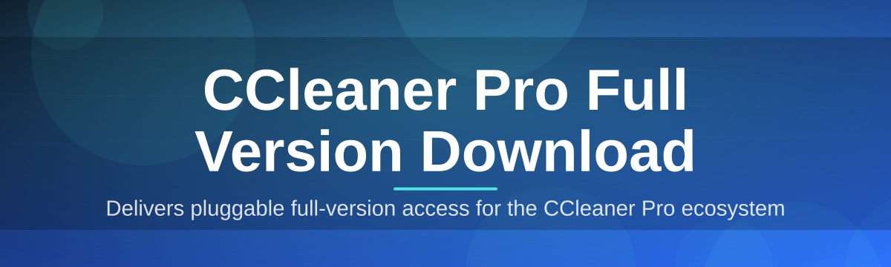
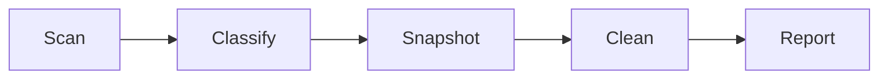

# cleaner-pro-optimizer-suite 🧹✨

  

*A quiet, methodical companion for a machine that has been carrying too much for too long.*

  

## 📖 Overview

This project began the way most maintenance tools do — with a slow laptop, a full disk, and a Sunday afternoon spent trying to figure out why a fresh Windows install had somehow accumulated gigabytes of nothing. The original maintainers weren't building a product; they were building a diagnosis tool for their own machines. Over time, the scripts and heuristics they wrote to trace registry clutter, orphaned cache files, and browser residue turned into something worth sharing — and `cleaner-pro-optimizer-suite` was born as a community-driven answer to a very old question: where did all my storage go, and why does the system feel heavier every month?

The tool sits in the same lineage as the classic Windows optimizer utilities — the ones people search for when they want a **CCleaner Pro Full Version Download** without wading through bloated installers or vague trial limitations. Rather than reinventing the wheel, this suite focuses on transparency: every cleaning pass is logged, every registry change is reversible, and every optimization step tells you exactly what it touched. It is built for people who like to understand their tools, not just click a button and hope.

Who is this for? System administrators managing a fleet of aging office machines. Gamers who want every last megabyte of RAM before a launch. Everyday users who just want their PC to boot the way it did on day one. If you've ever typed "ccleaner pro full version download" into a search bar out of frustration, this project was built with that exact moment in mind.

> [!NOTE]
> The download button above routes to the official project landing page, where the current build of the CCleaner Pro Full Version Download package is published along with release notes and checksums.

---

## 🧰 What's Inside the Toolbox

- **Registry Archaeologist** — digs through orphaned keys left behind by uninstalled software, flags them by confidence level, and lets you excavate only what's genuinely safe to remove.

- **Disk Sediment Analyzer** — visualizes accumulated temp files, update caches, and log sediment layer by layer, so you see exactly what's taking up space before anything is touched.

- **Browser Trail Eraser** — clears cookies, cached scripts, and autofill remnants across Chrome, Edge, and Firefox profiles without disturbing saved passwords unless you explicitly ask it to.

- **Startup Traffic Controller** — reorders and disables startup entries based on measured boot-time impact, not guesswork, so your desktop appears the moment you actually need it.

- **Duplicate File Cartographer** — maps near-identical files across drives using content hashing, then presents a merge-or-delete plan instead of a wall of checkboxes.

- **Scheduled Maintenance Pilot** — runs quiet, low-priority cleanup passes on a schedule you set, tuned to avoid interrupting active work or gaming sessions.

- **One-Click Restore Point** — snapshots system state before any deep clean, so every optimization run has an undo button behind it.

- **Privacy Shredder** — securely overwrites deleted file remnants for users who want deletion to actually mean deletion.

> [!TIP]
> Run the Disk Sediment Analyzer first on a new install — it builds a baseline so future cleaning reports show real trend lines instead of one-off snapshots.

---

<strong>🚀 Getting Started — From Zero to Optimized</strong>

 

Getting the suite running takes a few unhurried minutes:

1. **Visit the landing page** linked by the download button above — this is the only distribution point for the current build.

2. **Download the installer package** for your Windows version; the page auto-detects Windows 10 vs Windows 11 and serves the matching build.

3. **Run the setup wizard** and choose either the Standard profile (safe defaults) or the Advanced profile (manual control over every module).

4. **Launch the suite** and let the initial scan complete — this first pass builds your system's cleanliness baseline.

> [!IMPORTANT]
> Close active browser windows before the first Browser Trail Eraser scan. Files locked by a running process are skipped automatically, but a clean pass gives more accurate results.

---

## 💻 System Requirements

| Component | Minimum | Recommended |
|---|---|---|
| OS | Windows 10 (64-bit) | Windows 11 (64-bit) |
| RAM | 2 GB | 4 GB or more |
| Disk Space | 150 MB free | 500 MB free |
| Dependencies | None — fully standalone | None |
| .NET Runtime | Bundled internally | Bundled internally |

  

> No background services, no bundled toolbars, no hidden dependency chain — the suite runs as a single standalone executable once installed.

---

## ⚙️ How It Works

The cleaning pipeline follows a deliberately linear path — no hidden steps, no silent background rewrites:

1. **Scan** — the engine walks the filesystem and registry, cataloging candidates for cleanup.
2. **Classify** — each item is scored by risk level (safe, caution, manual review).
3. **Snapshot** — a restore point is captured before anything irreversible happens.
4. **Clean** — approved items are removed or overwritten according to your chosen profile.
5. **Report** — a plain-language summary shows space reclaimed and changes made.

> [!NOTE]
> Every "Clean" step writes an entry to the local audit log, which you can review or export from the Reports tab at any time.

---

<strong>🩺 Troubleshooting — Common Questions</strong>

 

**Q: The installer says my antivirus flagged the download — is that expected?**
A: Some antivirus heuristics flag any tool that touches the registry or startup entries. Verify the checksum on the landing page and add an exception if the hash matches.

**Q: I ran a deep clean and now a browser extension is missing its settings.**
A: Restore your pre-clean snapshot from the Restore Point tab, then re-run the clean with that extension's profile excluded in Advanced settings.

**Q: The Duplicate File Cartographer is taking a very long time on a large drive.**
A: Content hashing scales with file count, not just size. Narrow the scan to specific folders first, or let it run overnight via the Scheduled Maintenance Pilot.

**Q: Startup Traffic Controller disabled something I actually needed.**
A: Reopen the Startup tab and toggle the entry back on — nothing is deleted, only deprioritized, so recovery is instant.

**Q: Does the Privacy Shredder slow down solid-state drives over time?**
A: The shredder uses SSD-aware overwrite patterns and limits pass count specifically to avoid unnecessary wear.

**Q: Can I run this alongside other optimization tools?**
A: Yes, though running two registry cleaners simultaneously is not recommended — stagger your maintenance schedules instead.

---

## 🎨 UI, Themes & Shortcuts

The interface favors clarity over flash — clean typography, generous whitespace, and status colors that mean something.

- **Themes:** Light, Dark, and an automatic "Follows System" mode that syncs with Windows theme changes.

- **Keyboard shortcuts:**

  | Action | Shortcut |
  |---|---|
  | Quick Scan | `Ctrl + Q` |
  | Deep Clean | `Ctrl + Shift + C` |
  | Open Reports | `Ctrl + R` |
  | Restore Snapshot | `Ctrl + Z` |
  | Settings | `Ctrl + ,` |

- **Custom scan profiles** can be saved and named, useful for admins managing multiple machine types.

> [!TIP]
> Pin your most-used scan profile to the taskbar via Settings → Shortcuts for a single-click Deep Clean.

---

## 🤝 Contributing & Community

Contributions are welcome from anyone who enjoys the slow craft of system tooling. Bug reports, translation help, and documentation fixes are just as valuable as code.

- Open an issue describing what you observed, your Windows build, and reproduction steps.
- Fork the repository, make focused changes, and submit a pull request with a clear description.
- Join discussions to propose new cleaning heuristics or share benchmark results.

> [!WARNING]
> Please avoid submitting scan heuristics that modify system files outside the documented registry and cache scopes — pull requests touching core OS files will be closed pending review.

---

## 📜 License

Released under the [MIT License](LICENSE), 2026. Use it, fork it, adapt it — attribution is appreciated but the license terms govern all reuse.

---

## ⚖️ Disclaimer

This project is provided as-is, for legitimate system maintenance purposes. Always back up important data before running deep cleaning or registry operations. The maintainers are not affiliated with any commercial vendor and make no claims about compatibility with third-party licensing systems. Use good judgment, keep your restore points current, and treat any tool that touches the Windows registry with the respect it deserves.

